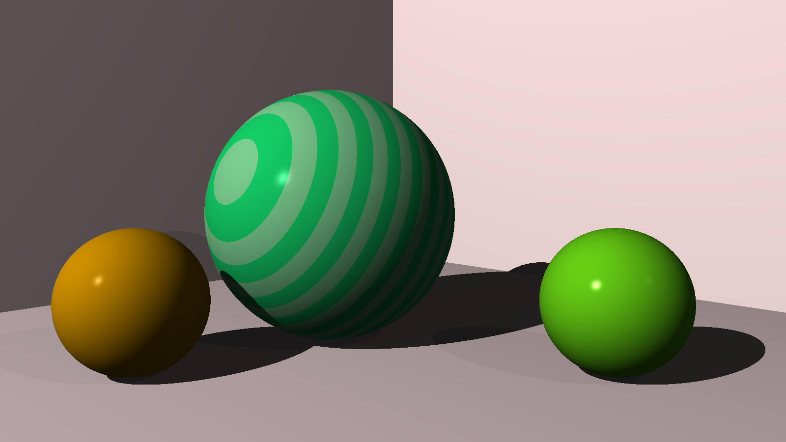

# Kotlin Ray Tracer
Learning Kotlin by reading through The Ray Tracer Challenge https://pragprog.com/book/jbtracer/the-ray-tracer-challenge and implementing the concepts in the book. This repo is to track my progress.

## Features
This ray tracer includes various shapes and is able to handle opaque, transparent and reflective surfaces

## Object types
1. Sphere
1. Plane
1. Cube
1. Cylinder
1. Cone
1. Triangle
1. CSG Operations
    1. Union
    1. Intersection
    1. Difference

## TODO
* [ ] Add area light
  * One idea is to add it as a type of material and then any object can become a light source
* [ ] Add a CompositeColor class
  * Convert current Color class to an Interface and add a SingleColor class?
  * CompositeColor should store multiple Colors (and perhaps the Points that they came from?) and return the average of the colors stored
  * See if this class can inherit from or implement Deferred or Deferred<Color>
* [ ] Change `inShadow` from a boolean to a float of brightness between 0 and 1
  * The brightness would be calculated by casting multiple rays from a point to different parts of the light source surface and return hits/rays cast
* [ ] Add aperture (focal length already exists) and cast multiple rays from the point of the camera starting in a circle the radius of the aperture and all aiming at the focal point
  * The number of rays to cast should be some function of the aperture size squared. e.g. size of 0 = 1 ray. size of 0.2 = 4 rays, size of 0.4 = 16 rays
* [ ] Add a roughness parameter to materials
  * The roughness should be an integer that dictates the number of ray to re-cast once a ray from the camera hits a point. The re-cast rays should be cast in random directions that are focused around the direction of a perfect reflection ray
  * This will give the image a sense of ambient color (maybe ignore the ambient parameter when roughness is used?)
* [ ] Add more sophisticated post-processing for "shadows" of transparent materials
  * For each light source and each transparent object, cast rays at the transparent object and trace the ray until it hits a non-transparent point.
  * When the point is hit, find all CompositeColors that correspond to the point and add the light hit to the list
  * Some light might be lost along the way if the material passed through is not 100% transparent
    
## Example

